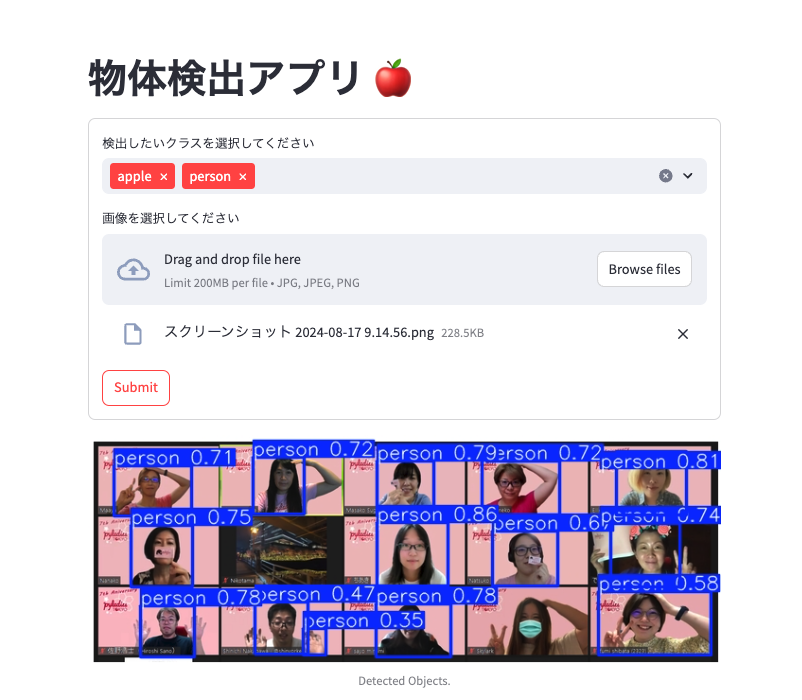

# StreamlitとYOLOを使って物体検出アプリを作成するハンズオン

このドキュメントは Pyladies Tokyo Meetup #94 のハンズオン資料です。
本ハンズオンでは、StreamlitとYOLOを使用して、物体検出アプリケーションを作成します。
- [サンプルGitHubリポジトリ](https://github.com/masakos/streamlit-yolo-hands-on-sample)
- [Pyladies Tokyo Meetup #94](https://pyladies-tokyo.connpass.com/event/326539/)

  - 注意 YOLO自体の詳しい説明は行いません。StreamlitとYOLOを使ってアプリを構築することを目指します。




## 目次

```{toctree}
preparation
streamlit
yoro
streamlit_yoro
streamlit_extensions
```

