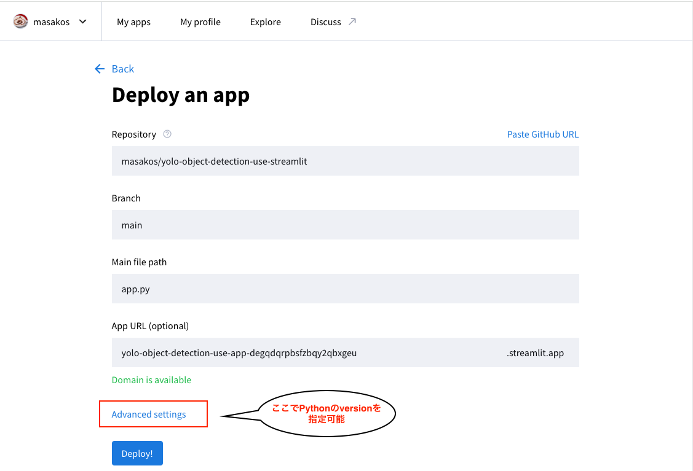

# Streamlitとは
[https://streamlit.io/](https://streamlit.io/)
- Pythonで作成されたオープンソースのWebフレームワークです
- Webアプリに必要なフロントエンドの知識(HTML,CSS, JavaScript)を必要としません
- データの可視化やWebアプリケーションの作成に使用されます
- 素早くアプリを作って公開することができます


### インストール
- インストール
```sh
$ pip install streamlit
```

- デモを体験してみよう
```sh
$ streamlit hello
```

### Streamlitの基本的な使い方
[API reference](https://docs.streamlit.io/develop/api-reference)

- Streamlit の起動
```
$ streamlit run st_sample.py
```

**st_sample.py というファイルを作成して、追加していきましょう!**
```{code-block} python
:caption: st_sample.py
import streamlit as st
import numpy as np
import pandas as pd

st.title('PyLadies Tokyo ハンズオン!')

st.markdown('## こんにちは :wave:')
st.markdown('### PyLadies Tokyoです')
st.markdown('- *Streamlit* はドキュメントが **充実** しているので ***[ここ]()*** をみればだいたい使い方がわかります。')
```

- データの表示
```
df = pd.DataFrame({
    'A列': [1, 2, 3, 4],
    'B列': [10, 20, 30, 40],
    'C列': [100, 200, 300, 400],
})

st.write('st.writeを使ったDataFrameの表示')
st.write(df)

st.write('st.dataframeを使ったDataFrameの表示')
st.dataframe(df.style.highlight_max(axis=0), width=500, height=200)
```

```
st.subheader("PyLadies Tokyo 参加者推移")

data = [
    [15,22,5],
    [5,15,12],
    [41,40,21],
    [19,13,0],
    [23,27,0],
    [17,21,7],
    [28,8,8],
    [6,8,13],
    [7,10,20],
    [35,20,18],
    [13,9,8],
    [21,4,32],
]
months = ['1月', '2月', '3月', '4月', '5月', '6月', '7月', '8月', '9月', '10月', '11月', '12月']
chart_data = pd.DataFrame(
    data,
    columns=['2015', '2020', '2023'],
    index=pd.CategoricalIndex(months, categories=months, ordered=True)
)

st.line_chart(chart_data)
st.area_chart(chart_data)
st.bar_chart(chart_data)
```


- Magic commands
  - 明示的なコマンドを入力せずに、ほとんど何でも (マークダウン、データ、グラフ) 記述できる

```
'''
# PyLadies Tokyo ハンズオン!
## こんにちは :wave:
### PyLadies Tokyoです
- *Streamlit* はドキュメントが **充実** しているので ***[ここ]()*** をみればだいたい使い方がわかります。
'''

df = pd.DataFrame({'col1': [1,2,3]})
df  # これでdfの中身がページに表示される

```

- image
```python
st.image('sugi.jpeg', caption='スライムさん', use_column_width=True)
```


**st_sample2.py というファイルを作成して、追加していきましょう!**
- インタラクティブなユーザーインターフェイス
```{code-block} python
:caption: st_sample2.py
import streamlit as st
import pandas as pd

#  text input
name = st.text_input('名前を入力してください')
st.write('名前:', name)

# check box
agree = st.checkbox('画像を表示しますか？')
if agree:
    st.image('image/suraimu.jpeg', caption='スライムさん', use_column_width=False)


# multi select
options = st.multiselect(
    ' あなたの好きな本を選んでください',
    options=['青', '黄色', '赤', 'ピンク', '金色'],
    default=['青'],
)
st.write('好きな色:', options)


# slider
history = st.slider("Python歴は?", 0, 33, 3)
st.write("私のPython歴は ", history, "です")


# camera input
picture = st.camera_input("撮影!")

if picture:
    st.image(picture)

# file upload
uploaded_file = st.file_uploader('画像を選択してください', type=['jpg','png'])
if uploaded_file is not None:
    st.image(uploaded_file)

uploaded_csv_file = st.file_uploader('csvファイルを選択してください', type=['csv'])
if uploaded_csv_file is not None:
    df = pd.read_csv(uploaded_csv_file)
    st.write(df)

```

- サイドバー
```
st.sidebar.text_input('名前を入力してください')
```


## アプリの公開

githubにStreamlitのアプリをpushしておくと、1分程度でアプリを公開できます！！

手順は以下の3ステップ

1. Streamlit 公式ページ右上の `Sign up` で Streamlit Community Cloud のアカウトを作成
2. Githubと連携
    

3. New appから、必要な3項目を入力して `Deploy!` ボタンをクリックするだけ
    

- [demoURL](https://yolo-object-detection-abavrjes8taktln9dpuejj.streamlit.app/)
- [github](https://github.com/masakos/yolo-object-detection-use-streamlit)


:::{card} ヒント
ハンズオンで作成したアプリでは、`opencv-python` を使用していますがこちらのライブラリではdeploy時エラーになるため、
`opencv-python-headless` を使用する必要があります。
Cloudにデプロイする場合は、以下のように opencv-python-headlessに変更してください。

$ pip uninstall opencv-python<br>
$ pip install opencv-python-headless<br>
$ pip freeze > requirements.txt
:::
